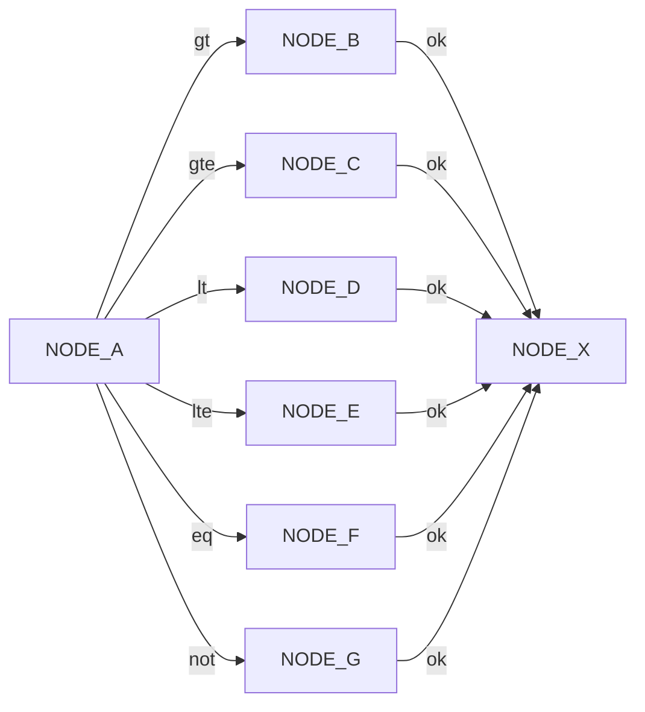

Edges connect nodes together. Each node can have one to many results based on what's
returned from the `NodeCode`. 

In this example NODE_A has 6 edges which connect NODE_A to nodes NODE_B...NODE_G based on
results of NODE_A. This example uses shorthand for comparing two variables. The shorthand
for `gt` is Greater Than. The shorthand for `gte` is Greater Than or Equal. You get the
picture.

## What if
What if a NodeCode result doesn't map to an edge. This is an invalid process and an error
should be thrown during validation.