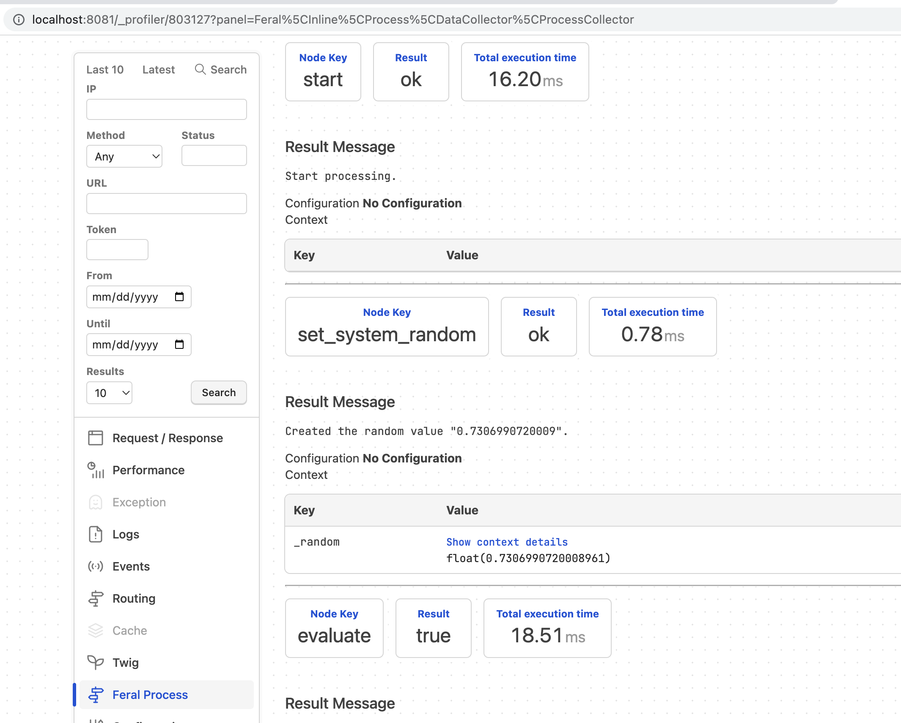

There are several events dispatched in the execution of a process. There is a start
and end process events that can be observed for managing processes themselves. There
are before and after node events that gets dispatched for each node. These can be
used for cycle detection, debugging, or telemetry.

[Events Namespace](https://github.com/cybermantix/feral-core/tree/master/src/Process/Event)

* _ProcessStartEvent_ - Dispatched before a process runs
* _ProcessEndEvent_ - Dispatched after a process runs
* _ProcessNodeBeforeEvent_ - Dispatched before a node is processed
* _ProcessNodeAfterEvent_ - Dispatched after a node is processed
* _ProcessExceptionEvent_ - Dispatched if there is an exceptinon. Note, this is process engine dependent
* _ProcessNodeNotifyEvent_ - Dispatched by a node if its needs to notify the event dispatcher.

## CycleDetectionProcessSubscriber ##
[See **`CycleDetectionProcessSubscriber`**](https://github.com/cybermantix/feral-inline/blob/master/src/Process/Event/Listener/CycleDetectionProcessSubscriber.php)

The Feral Inline package contains a cycle detection class that listens for nodes that are processed more times
than they should. The Cycle Detection class is a process subscriber that subcribes to the StartProcess
and BeforeNode events.

```php 
    public static function getSubscribedEvents(): array
    {
        return [
            ProcessStartEvent::class => ['onStartProcess'],
            ProcessNodeBeforeEvent::class => ['onBeforeNode']
        ];
    }
```

## LoggerProcessSubscriber ##
[See **`LoggerProcessSubscriber`**](https://github.com/cybermantix/feral-inline/blob/master/src/Process/Event/Listener/LoggerProcessSubscriber.php)

The logger process subscriber listens for the process events and logs them to the PSR logger interface.

```php 
    public static function getSubscribedEvents(): array
    {
        return [
            ProcessStartEvent::class => ['onStartProcess'],
            ProcessEndEvent::class => ['onEndProcess'],
            ProcessNodeBeforeEvent::class => ['onBeforeNode'],
            ProcessNodeAfterEvent::class => ['onAfterNode'],
            ProcessExceptionEvent::class => ['onProcessException'],
            ProcessNodeNotifyEvent::class => ['onNodeNotify'],
        ];
    }
```
## ProfilerProcessSubscriber ##
[See **`ProfilerProcessSubscriber`**](https://github.com/cybermantix/feral-inline/blob/master/src/Process/Event/Listener/ProfilerProcessSubscriber.php)

The profilers subscriber is used with Symfony to show the process flow in the Symfony Profiler.
This is used for debugging only.



```php 
    public static function getSubscribedEvents(): array
    {
        return [
            ProcessStartEvent::class => ['onStartEvent'],
            ProcessEndEvent::class => ['onEndEvent'],
            ProcessNodeBeforeEvent::class => ['onNodeBeforeEvent'],
            ProcessNodeAfterEvent::class => ['onNodeAfterEvent']
        ];
    }
```


