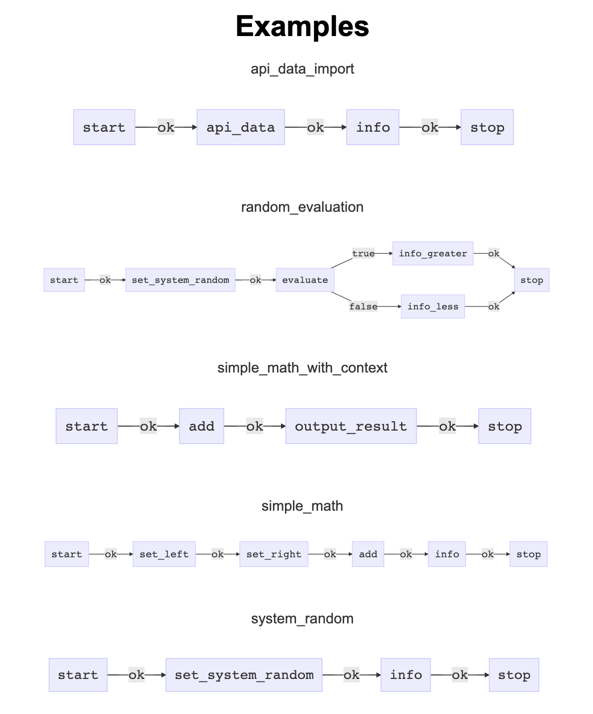
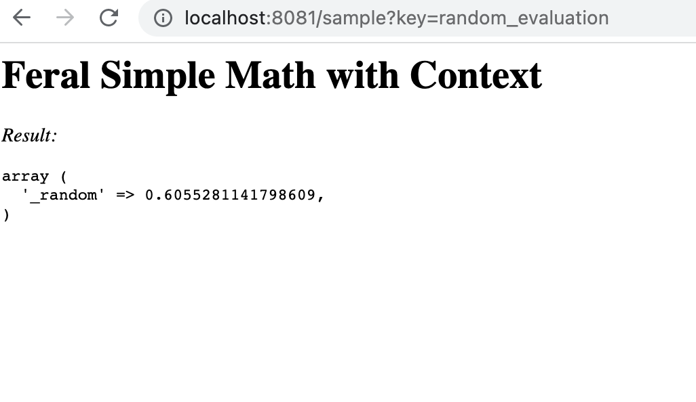
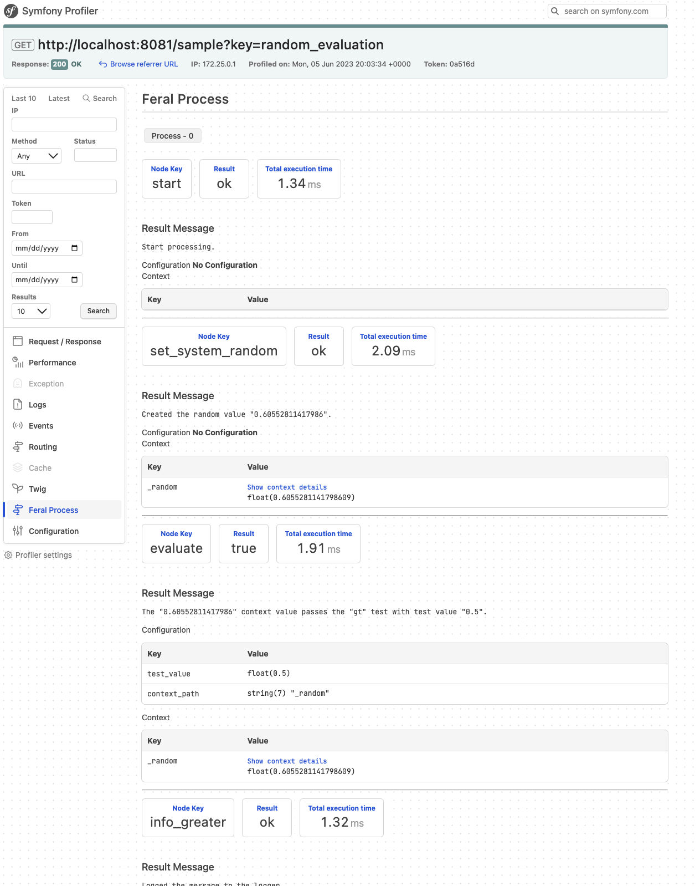

## Inline Sample Project

We created a sample project that includes multiple processes and examples. The sample project uses Symfony as a framework and has the ability to run a process from the console and also from the browser via a container. 


### Step 1: Visit the GitHub project 

The GitHub project can be found at https://github.com/cybermantix/feral-inline-sample.

### Step 2: Sample Processes

<details>
  <summary>Available Example Processes</summary>
  <div>
    <div>Here is a list of the processes available in the sample app</div>
    <br/>
    <ul>
       <li>api_data_import</li>
       <li>random_evaluation</li>
       <li>simple_math_with_context</li>
       <li>simple_math</li>
       <li>system_random</li>
       <li>test_process</li>
    </ul>
  </div>
</details>



### Step 3: Run processes from the command line
```bash
bin/console feral:run  random_evaluation -vv
```
Output
```shell
Process Key: random_evaluation
-----------
  CONTEXT
-----------
Context:  was not passed in.
-----------
  PROCESS
-----------
[info] Starting a process with 6 nodes.
[info] Processing Node start
[info] Processing Node set_system_random
[info] Processing Node evaluate
[info] Processing Node info_greater
[info] The system random is 0.99985052412369 and is GREATER than the test value 0.5
[info] Processing Node stop
[info] Process Complete
------------
  FINALIZE
------------
Process 'random_evaluation' Complete.
```

### Step 4: Run the processes from the controller
In your browser, visit the your development web server or container `http://localhost:8081/`
Click on the title of the process `random_evaluation`.


## The power of a process
Note the exact same process can be run via the command line console or in a controller in a browser. This allows you to write the process once and run it with multiple drivers like the console or web controller.

