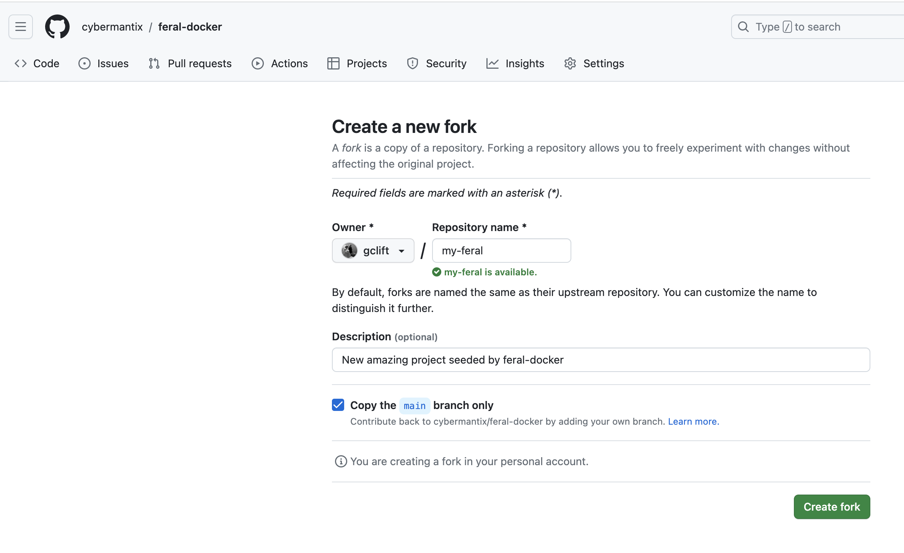
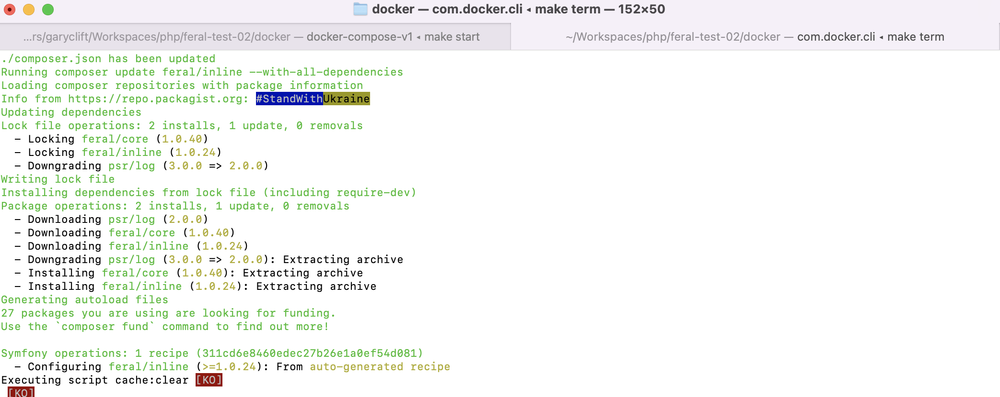

We have created a project you can fork and start building your own project with Docker built in.
This project has the Dockerfile which provides the base PHP-FPM. It also contains the docker-compose file
to make it easy to include Nginx and the project's app image. 

## Step 1: Fork the repository
Like a good cover, say [Siouxsie & The Banshees 'The Passenger'](https://www.youtube.com/watch?v=4nAON-MwUPY), the best work is based on an established work.
The first step to using the Feral Docker project as a base is to fork the repository.

1. Visit https://github.com/cybermantix/feral-docker
2. Click `Fork` in the sub nav.
3. Enter the new repository and description
4. Click `Create Fork`




## Step 2: Clone your fork locally

After you have forked the repo, you need to clone it to your development environment
to start building. 

```bash 
git clone ssh://john@example.com/path/to/my-project.git 
cd my-project 
```
## Step 3: Build the Feral Docker Image

Once you have cloned the repository locally, you'll need to build the docker image. To
build the image, you'll need to cd into the docker directory of your project and use the
Makefile target `build` to build the image.

:::caution
This could take several minutes to build.
:::

```bash 
cd docker
make build
```

## Step 4: Start the container and make a terminal

:::info
This tutorial will use two terminal tabs. The first will be the `runner` tab which you
will start the container and will continue to remain connected to the container. The
second tab is the `term` tab used to get a terminal in the container.



:::

Once the Docker image is built, you can create a container with the image. Using the 
`start` target in the Make file

```bash 
# RUNNER TAB (left tab)
# from the docker directory
make start
```

In the current terminal window you'll see information from the `docker/bin/startup` script. 
Once you see PHP-FPM is ready to handle connections, you can create a terminal window.

```bash 
# TERM TAB (right tab)
# in a seperate terminal window or tab
# from the docker directory
make term
```

At this point you should have two terminal windows or tabs. You can see the output of
each container in the initial window.

## Step 5: Install Symfony and Feral Inline

:::caution
Do this step from the Docker terminal window, in the right tab.
:::

The Makefile contains a target `install` which will install symfony and the feral-inline package.
To run the install target, in the terminal window type `make install`.

```bash 
# in the terminal window running the the term command
# from the /opt/app directory
make install
```

## Step 6: Run Feral commands

```bash 
# in the terminal window running the the term command
# from the /opt/app directory
bin/console feral:catalog
```

The output will show all of the CatalogNodes available in the project.

```bash 
# output

Feral Catalog
CALCULATION
 - Add (add) : Add two values stored in the context.
 - Divide (divide) : Divide two values stored in the context.
 - Multiply (multiply) : Multiply two values stored in the context.
 - Power (power) : Raise the value from the x path to the power of y.
 - Random (random) : Add a random value to the context
 - Subtract (subtract) : Subtract two values stored in the context.
 - System Random (system_random) : Add a random value to the _random context key

COMPARATOR
 - Equals Zero (equals_zero) : Check if a context value is zero.
 - Greater Than (greater_than) : Check if a context value is greater than a configuration value.
 - Greater Than Zero (greater_than_zero) : Check if a context value is greater than zero.
 - Less Than Zero (less_than_zero) : Check if a context value is less than zero.

CONTEXT
 - Set Context Value (set_context_value) : Set a value in the context using a value and a path to the location.

DATA
 - Counter (counter) : A counter that ticks every time the node is processed.

FLOW
 - Start Processing (start) : The start node will start a process and return an OK result.
 - Stop Processing (stop) : The stop node will end a process.
 - Throw Exception (throw) : Throw an exception.

LOG
 - Debug Logger (log_debug) : Log a message with the debug level
 - Error Logger (log_error) : Log a message with the error level
 - Info Logger (log_info) : Log a message with the info level
 - Notice Logger (log_notice) : Log a message with the notice level
 - Warning Logger (log_warning) : Log a message with the warning level

```