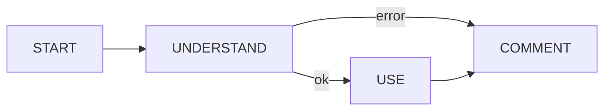

# Feral Code Composition Framework (CCF)

***Introducing Feral: The Code Composition Framework for the misfits, the dropouts, the freaks***

In the fast-paced realm of software development, composing and integrating code components can often be a daunting and time-consuming task. As developers, we understand the need for a robust framework that simplifies code composition and empowers us to build exceptional software solutions effortlessly.

We are thrilled to introduce Feral (Code Composition Framework), a cutting-edge platform designed to revolutionize the way developers compose code. With Feral, developers can streamline their workflows, manage dependencies seamlessly, and collaborate more effectively, all while harnessing the full potential of their coding expertise.

At its core, Feral serves as a versatile toolkit, empowering developers to create modular and scalable applications with unparalleled ease. Whether you're working on a small project or a complex enterprise system, Feral provides the essential tools and features to enhance productivity and streamline development processes.

Key Features of Feral:

1. *Dependency Management*: Simplify the management of code dependencies by effortlessly resolving conflicts and automating the installation and configuration of libraries and frameworks. Feral ensures a smooth integration process, saving you time and reducing compatibility issues.
2. *Code Composition*: Seamlessly combine code modules, libraries, and frameworks to create cohesive applications. Feral offers a user-friendly interface that allows you to define composition rules, making it simple to integrate various code components and achieve high levels of code reusability.
3. *A Node Hierarchy*: It has never been easier to reuse code by making Node Code unique to catalog nodes and process nodes.
4. *Marketplace*: Don't see a node that does exactly what you are looking for, visit the marketplace and search our library of bundles.
5. *Extensibility and Customization*: Customize and extend Feral to fit your specific requirements. With support for plugins and customizable composition rules, you can adapt the framework to integrate specialized frameworks, libraries, or unique code composition patterns.

By embracing Feral, developers can skip the tedious work, allowing them to focus on innovation rather than the complexities of code integration. Say goodbye to arduous composition tasks and welcome a more streamlined, productive, and enjoyable development experience.

Join us on this exciting journey as we empower developers with Feral, unleashing the power of code composition. Experience a new era of software development and revolutionize the way you build exceptional applications. Start your adventure with Feral today and witness the future of code composition unfold before your eyes!

## Getting Started

Feral is written in PHP and uses Composer and Symfony. Getting started with the free version of Feral is easy.

See [Quick Start Guide](getting-started/quick-start.md) 

## License

See [our license](/LICENSE.md) Apache License Versino 2.0

