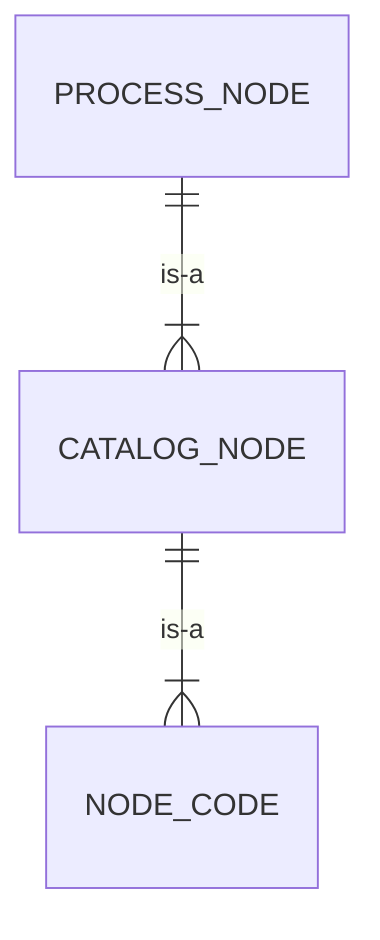
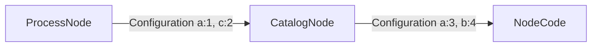
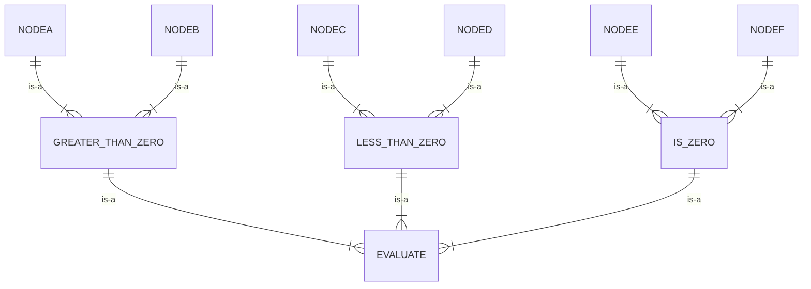

## Multiple parts to a Node
Nodes are the base of a process's functionality. Nodes are are composed of three levels
of configuration and functionality. The base level is the `NodeCode` which contains the 
functionality of the node and defines the configuration and possible return values. 
`CatalogNodes` apply configuration for the `NodeCode` and are available in the catalog
for a process to use. A `ProcessNode` is the highest level of configuration and is added
to a process.



## Configuration
Nodes are a hierarchy of configuration that is compiled and nodes which include processing
code based on the configuration.


:::caution
A `ProcessNode` configuration cannot override a `CatalogNode` configuration. If there is 
a configuration collision (same configuration key) then the `CatalogNode` configuration value
will be used.



In this example the final configuration would be `a:3, b:4, c:2` as the `CatalogNode` configuration
for a would take precedence over the `ProcessNodes` value for a.

:::

To see configuration options [See NodeCode:Configuration](/docs/nodes/node-code#nodecode-configuration)


## Hierarchy
A `NodeCode` can have multiple `CatalogNodes` that supply different configurations
to the underlying `NodeCode`. In turn, each `CatalogNode` can have multiple `ProcessNodes`
which can supply more configuration to the `NodeCode`.

This hierarchy of code allows easy reuse of the `NodeCode` and the `CatalogNodes`.


## How-To Create a Node

:::info
Follow the Getting Started guide for the Feral Inline package first.
:::

In this How-To we will walk through how the CalculationNodeCode was built.

### 1. Add a new class file to your project
Using your IDE, create a new class (called CalculationNodeCode) in the src/Process/NodeCode directory.
```php 
<?php

  namespace Feral\Core\Process\NodeCode\Data;
  
  use Feral\Core\Process\NodeCode\NodeCodeInterface;
  
  class CalculationNodeCode implements NodeCodeInterface
  {
```

### 2. Add any helper traits
There are a lot of helper traits that will help build your NodeCode. See the namespace
src/Process/NodeCode/Traits for all core traits.

```php 
...
...
...
class CalculationNodeCode implements NodeCodeInterface
{
    use NodeCodeMetaTrait,      // adds instance vars, getters, and settters
        ResultsTrait,           // adds a protected results method
        ConfigurationTrait,     // adds the configuration and configuration manager
        ConfigurationValueTrait,// adds helper methods to get a configuration value
        EmptyConfigurationDescriptionTrait, // add the function to return an empty configuratioon
        ContextValueTrait,      // adds the functions to get a value from the context
        ContextMutationTrait,   // adds the functions to modify the conteext
        OkResultsTrait;         // adds the get results description method to return an OK result
...
...
... 
```

### 3. Add constants for context keys or default values
Multiple parts of the NodeCode class will use similar configuration, results, and context keys. Use
contants to set the values then use the constants in the class.

```php 
...
...
...
    const KEY = 'calculation';      // the key for the NodeCode used in CatalogNodes
    const NAME = 'Calculation';     // The name of the NodeCode
    const DESCRIPTION = 'Take the values from ,,.'; // the description of the node code
    const X_CONTEXT_PATH = 'x_context_path';    // The key for the context path to get the x value
    const Y_CONTEXT_PATH = 'y_context_path';    // the key for the context path to get the y value
    const RESULT_PATH = 'result_context_path';  // the key for the context path where to put the results
    const OPERATION = 'operation';  // the key for the configuration 
    const ADD = 'add';              // the value for the configuration
    const SUBTRACT = 'subtract';    // the value for the configuration
    const MULTIPLY = 'multiply';    // the value for the configuration
    const DIVIDE = 'divide';        // the value for the configuration
    const POWER = 'power';          // the value for the configuration
...
...
...
```

### 4. Add the constructor and any dependent classes
Each NodeCode can have its own dependencies. Using Symfony we can inject the
dependencies into the constructor.

```php 
...
...
...
    public function __construct(
        DataPathReaderInterface $dataPathReader = new DataPathReader(),
        DataPathWriter $dataPathWriter = new DataPathWriter(),
        ConfigurationManager $configurationManager = new ConfigurationManager()
    ) {
        $this->setMeta(
            self::KEY,
            self::NAME,
            self::DESCRIPTION,
            NodeCodeCategoryInterface::DATA
        )
            ->setConfigurationManager($configurationManager)
            ->setDataPathWriter($dataPathWriter)
            ->setDataPathReader($dataPathReader);
    }
...
...
...
```

### 5. Add the configuration descriptions
Each NodeCode can have configuration added. The configuration is defined using
objects that implement the ConfigurationDescriptionInterface. See
Feral\Core\Process\NodeCode\Configuration\Description; for the classes available
in the core.

```php 
...
...
...

    /**
     * @return ConfigurationDescriptionInterface[]
     */
    public function getConfigurationDescriptions(): array
    {
        return [
            (new StringConfigurationDescription())
                ->setKey(self::X_CONTEXT_PATH)
                ->setName('X Context Path')
                ->setDescription('The context path to the first variable, the left side, of the equation.'),
            (new StringConfigurationDescription())
                ->setKey(self::Y_CONTEXT_PATH)
                ->setName('Y Context Path')
                ->setDescription('The context path to the second variable, the right side, of the equation.'),
            (new StringConfigurationDescription())
                ->setKey(self::RESULT_PATH)
                ->setName('Result Context Path')
                ->setDescription('The context path to set the results of the operation.'),
            (new StringConfigurationDescription())
                ->setKey(self::OPERATION)
                ->setName('Calculation Operation')
                ->setDescription('The mathematical operation to apply to the variables.')
                ->setOptions(
                    [
                        self::ADD,
                        self::SUBTRACT,
                        self::MULTIPLY,
                        self::DIVIDE,
                        self::POWER,
                    ]
                )
        ];
    }
...
...
...
```

### 6. Add the process method
This is the heart of a NodeCode. When a process is run the engine will pass
the context into the process method which should return a result. You can
use the helper traits defined above to make it easy to work with the
configuration, context, and results.

```php 
...
...
...
    /**
     * @inheritDoc
     * @throws     MissingConfigurationValueException|UnknownComparatorException
     * @throws     Exception
     */
    public function process(ContextInterface $context): ResultInterface
    {
        $xPath = $this->getRequiredConfigurationValue(self::X_CONTEXT_PATH);
        $yPath = $this->getRequiredConfigurationValue(self::Y_CONTEXT_PATH);
        $operation = $this->getRequiredConfigurationValue(self::OPERATION);
        $resultPath = $this->getRequiredConfigurationValue(self::RESULT_PATH);
        $x = $this->getValueFromContext($xPath, $context);
        $y = $this->getValueFromContext($yPath, $context);
        $result = match($operation) {
            self::ADD => $x + $y,
            self::SUBTRACT => $x - $y,
            self::MULTIPLY => $x * $y,
            self::DIVIDE => $x / $y,
            self::POWER => pow($x, $y)
        };

        $this->setValueInContext($resultPath, $result, $context);

        return $this->result(
            ResultInterface::OK,
            'Applied operator "%s" path "%s" and "%s".',
            [$operation, $xPath, $yPath]
        );
    }
...
...
...
```

### 7. Add The CatalogNode Decorators
Process nodes use CatalogNodes. It's easy to add CatalogNodes right in your
NodeCode if there are obvious configuration values.
```php 
...
...
...
#[CatalogNodeDecorator(
    key:'add',
    name: 'Add',
    group: 'Data',
    description: 'Add two values stored in the context',
    configuration: [self::OPERATOR => self::::ADD])]
#[CatalogNodeDecorator(
    key:'subtract',
    name: 'Subtract',
    group: 'Data',
    description: 'Subtract the y value from the x value stored in the context',
    configuration: [self::OPERATOR => self::::SUBTRACT])]
  class CalculationNodeCode implements NodeCodeInterface
  {
...
...
...
```

### 8. Create the ProocessNode
In your process, create the ProcessNode to use the CatalogNode created above. Add
the additional configuration values required by the NodeCode not defined in the
CatalogNode.

```json 
...
...
...
    {
      "key": "add",
      "description": "Add the two values together",
      "catalog_node_key": "add",
      "configuration": {
        "x_context_path": "left",
        "y_context_path": "right",
        "result_context_path": "result"
      },
      "edges":  {
        "ok": "output_result"
      }
    },
...
...
...
```