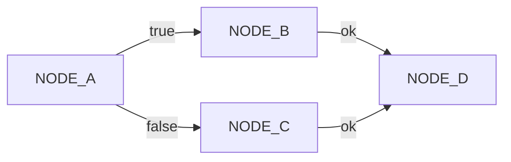

## What is a Process?

A process is a well-defined configuration and reusable code that can be driven by other 
activities in an application. A process can be run from the command line or driven by
a web controller, a queue handler, or any other driver. 

A process is a collection of reusable nodes that perform work based on a context and 
return a result. These results are used to map the process engine to move to the next 
node. This node processing / results activity continues until the end node is reached.

## Nodes

A node is actually a three-tier-structure consisting of NodeCode that actually processes information and uses configuration from the catalog node and process node levels. The NodeCode instance receives the configuration from it's Catalog Node and Process node when it's built then during process run time, the node receives the context which contains the data to be processed.

```
  Process Node
     |
     | Configuration
     v
  Catalog Node
     |
     | Configuration
     v
  NodeCode
```

[**Read More** about Nodes](./nodes)


## Edges

An edge connects nodes together creating a process flow. An edge is the combinationo of a source node, a result, and a destination node. A source node can have multiple edges, each with a unique result. A destination node can have multiple edges with non-unique results.

```
                 ---- true  ---> NODE_B --- ok ---
   NODE_A  -----|                                 | --> NODE_D
                 ---- false ---> NODE_C --- ok ---

```



[**Read More** about Edges](./edges)

## Results

After the Node processes the context and any activities performed with the node, the 
result object is returned to the process engine. The results consist of status and a 
message. The status is used to route the process flow to the next node and the message 
is used for observability of the operation of the process.

[**Read More** about Results](./results)

## Context

The context is the data store which hold information passed between nodes in the 
process. The context is a simple key/value storage system but can hold arrays, 
scalars, and objects as values. The initial context can hold values from the process 
driver such as the command line runner or the controller action.

[**Read More** about Context](./context)

## Events

During the process flow, events are dispatched allowing code to observe the various events. 
Events
* Process Start
* Process End
* Process Node Before
* Process Node End
* Process Node Exception

[**Read More** about Events](./events)