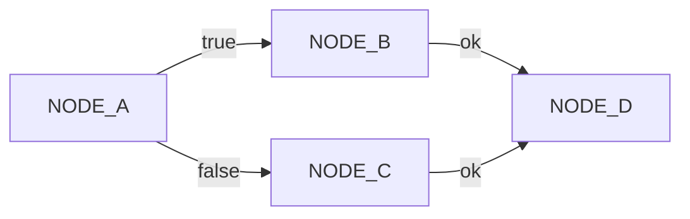
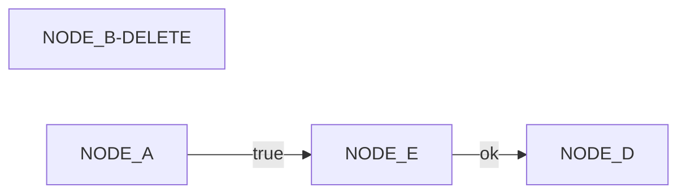
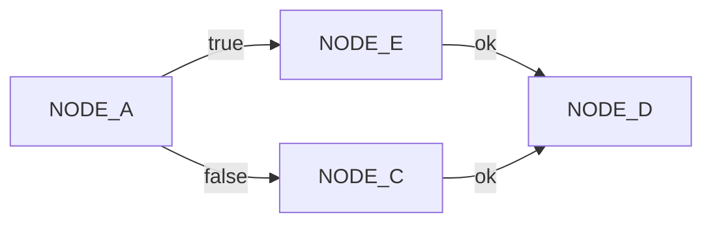

A Process override is a process configuration that can alter a process configuration.
With a process override you can add new ProcessNodes, modify ProcessNodes, or delete
ProcessNodes before the process is run. These overrides make it possible to have a 
base process then have custom processes based on other factors like customer, locale,
time, or other factors.

**Base Process**

**Override**

Our override will delete NODE_B. Then add NODE_E and change
the edges of NODE_A true result to map to NODE_E.

**Resulting Process**

The resulting process will include the changes from the override and apply
those to the base process. Here you can see the change from NODE_A to NODE_E
and then to NODE_D.
