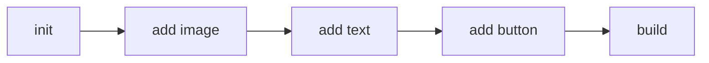

Start the process by returning the OK status.

## Key
`slack_section_block_builder`

## Configuration Keys:
* `function` - The builder function to run. Examples init, add_button, build
* `options` - The options used in the builder function. Each function has different options.
* `block_path` - The path where the block will be stored after the build function.
* `context_options` - The path in the context for options. This can be used for dynamic text.

## Results
* `ok` - The function has been run

## Function Options

* init
  * Surface (optional)
* add_button
  * action_id
  * label
  * url (optional)
  * value (optional)
  * style (optional)

## Example 
The builder node starts with the init function followed by add function. Once the content
is complete, call the build function.



## Process Method
```php
 public function process(ContextInterface $context): ResultInterface
    {
        $fn = $this->getConfigurationValue(self::CNF_FUNCTION);
        $configOptions = $this->getArrayConfigurationValue(self::CNF_OPTIONS, []);
        $contextOptions = $this->getValueFromContext(self::CTX_OPTIONS, $context) ?? [];
        $options = array_merge($configOptions, $contextOptions);

        switch($fn) {
            case self::INIT:
                $this->builder->initAsSectionForSurface($options[self::OPTION_SURFACE] ?? Surface::MESSAGE);
                break;
            case self::ADD_BUTTON:
                $this->builder->addButton(
                    $options[self::OPTION_ACTION_ID],
                    $options[self::OPTION_LABEL],
                    $options[self::OPTION_URL] ?? null,
                    $options[self::OPTION_VALUE] ?? null,
                    $options[self::OPTION_STYLE] ?? null,
                );
                break;
            case self::ADD_TEXT:
                $this->builder->addText(
                    $options[self::OPTION_LABEL],
                    $options[self::OPTION_TYPE] ?? Text::PLAIN,
                    $options[self::OPTION_EMOJI] ?? null,
                    $options[self::OPTION_VERBATIM] ?? false,
                );
                break;
            case self::ADD_CHECKBOX:
                $this->builder->addCheckboxWithArray(
                    $options[self::OPTION_ACTION_ID],
                    $options[self::OPTION_CHOICES],
                    $options[self::OPTION_CHOSEN] ?? [],
                );
                break;
            case self::ADD_IMAGE:
                $this->builder->addImage(
                    $options[self::OPTION_URL],
                    $options[self::OPTION_TEXT] ?? null,
                );
                break;
            case self::ADD_DATEPICKER:
                $this->builder->addDatePicker(
                    $options[self::OPTION_ACTION_ID],
                    $options[self::OPTION_TEXT] ?? null,
                    $options[self::OPTION_DATE] ?? null,
                );
                break;
            case self::ADD_INPUT:
                $this->builder->addPlainTextInput(
                    $options[self::OPTION_ACTION_ID],
                    $options[self::OPTION_TEXT] ?? null,
                    $options[self::OPTION_VALUE] ?? null,
                    $options[self::OPTION_MULTILINE] ?? null,
                    $options[self::OPTION_MINIMUM_LENGTH] ?? null,
                    $options[self::OPTION_MAXIMUM_LENGTH] ?? null,
                );
                break;
            case self::BUILD:
                $path = $this->getStringConfigurationValue(self::CNF_CTX_BLOCK, self::DCNF_CTX_BLOCK);
                $block = $this->builder->build();
                $this->setValueInContext($path, $block, $context);
                break;
            default:
                throw new \SlackBlockException(sprintf('Invalid function "%s"', $fn));
        }


        return $this->result(
            ResultInterface::OK,
            'Slack Block Builder processed function "%s" on the builder.',
            [$fn]
        );
    }
```