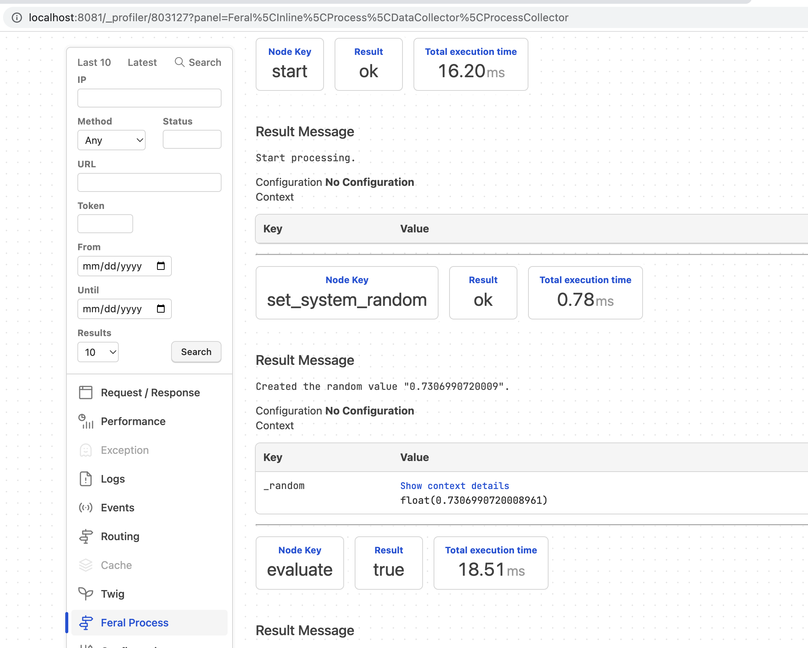

The [Symfony Profiler](https://symfony.com/doc/current/profiler.html) is a powerful
debugging tool when building applications with Symfony. The profiler collects information
when handeling HTTP requests via the controllers. 

The Feral Inline package contains the
[**`ProfilerProcessSubscriber`**](https://github.com/cybermantix/feral-inline/blob/master/src/Process/Event/Listener/ProfilerProcessSubscriber.php)
event handler which listens for the process and node events to illustrate the process
flow that was executed.

:::danger
As noted by the Symfony team, the profiler should never be used in production.
:::

